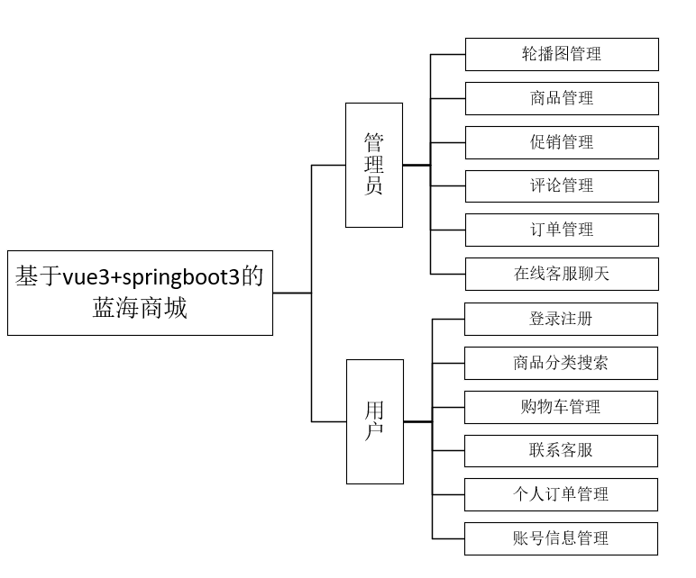
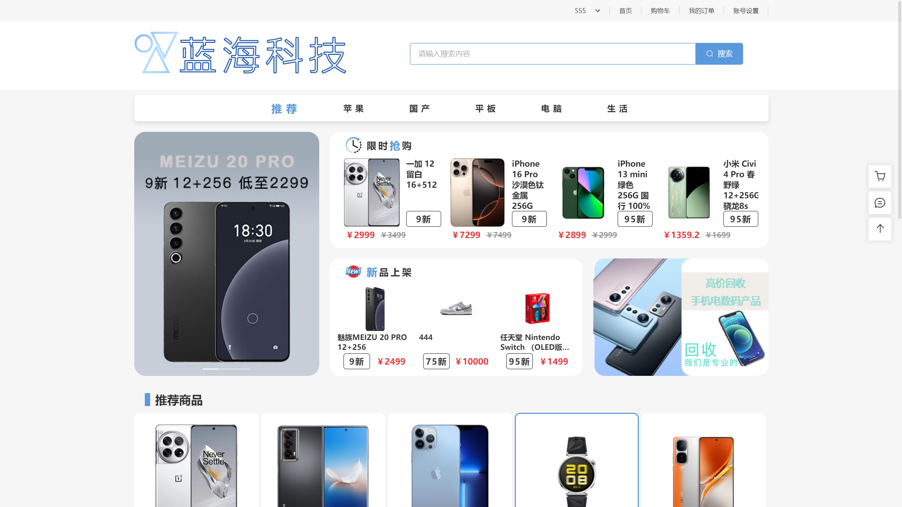
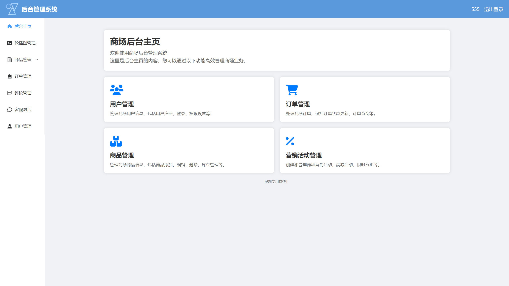

# 蓝海商城（bluesea）

## 介绍

本项目为蓝海商城项目，采用Vue3、Element-Plus、axios、sass等技术栈，本项目将采用前台通过UserAgent请求头信息来识别手机端和pc端的路由切换，进行不同端页面的展示，前台目前只完成了pc端的制作，手机端待开发，后台采用的是媒体查询以及视口宽度单位进行响应式页面适配。

后端基于springboot3+jwt+mybatis进行接口编写，主要应用功能有邮箱验证、文件上传、登录鉴权、类协同过滤推荐算法、webscoket客服聊天等等。

## 项目亮点

邮箱验证，webscoket实时通信，类协同过滤推荐算法，支付宝沙箱支付

## 项目链接

bluesea-vue3：[LZ7595/bluesea-vue3 · GitHub](https://github.com/LZ7595/bluesea-vue3.git)

bluesea-springboot3：[LZ7595/bluesea-springboot3 · GitHub](https://github.com/LZ7595/bluesea-springboot3.git)

## 技术栈

1. 前端vue3.5，element-plus，pinia，sass，axios

2. 后端java jdk17，springboot3，websocket，jwt，lombok

3. 数据库mysql8

## 系统结构图



## 功能介绍

### 商城前台

- 首页

- 商品分类搜索

- 首页轮播广告

- 每日上新栏目

- 限时秒杀栏目

- 首页商品推荐

- 分类商品展现

- 购物车

- 购物车商品管理

- 商品详情

- 账号设置

- 修改密码

- 邮箱换绑

- 登录注册

- 支付宝沙箱支付

- 地址管理

- 订单管理

- 订单详情

- 商品评论

- 客服对话

### 管理后台

- 首页介绍

- 轮播图管理

- 商品管理

- 促销管理

- 订单管理

- 评论管理

- 客服对话

- 用户管理

## 环境配置

jdk不低于17，MySQL 5.7或者8，node.js版本18以上，maven版本建议3.8及以上


#### 项目文件结构

```
blueseaplus
├── backend
├── files
├── frontend
└── blueseaplus.sql  
```

#### 后端运行步骤

1. 下载JDK 17，并配置环境变量

2. 下载后端代码后，使用IntelliJ IDEA打开至/src/main/resources

3. 配置resources目录中的application.yml文件，配置数据库账号密码、静态资源路径、文件储存路径

4. 安装mysql 8数据库，并创建数据库，创建SQL如下：
   
   ```
   CREATE DATABASE IF NOT EXISTS blueseaplus DEFAULT CHARSET utf8 COLLATE utf8_general_ci
   ```

5. 恢复sql数据。在mysql下依次执行如下命令：
   
   ```
   mysql> use blueseaplus;
   mysql> source D:/xxx/xxx/xxx.sql;
   ```

6. 启动后端服务：点击IDEA顶部run按钮

#### 前端运行步骤

1. 安装node 20.12.2

2. 修改前端目录/src/vite.config.js下的constansts.ts文件中的代理地址，改成你自己后端的地址

3. cmd命令进入前端根目录下，安装依赖，执行:
   
   ```
   npm install 
   ```

4. 运行项目
   
   ```
   npm run dev
   ```

5. 在浏览器输入: http://localhost:5173即可预览

### 界面预览

首页



后台页面


